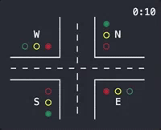
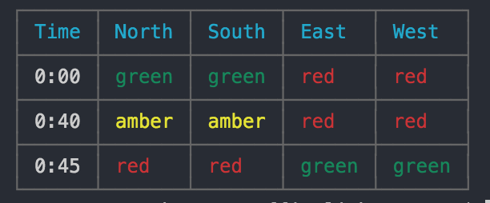

# Traffic Lights

### Overview

Shows a set of traffic lights at an intersection.
Designed to work with multiple types of intersections,
but the example is based on a 4-way cross-intersection.

### Install

Clone repository and install dependancies. Requires `Node` (tested with Node 6.x)

```bash
$ git clone git@github.com:rogchap/traffic-lights.git
$ cd traffic-lights
$ npm i
```

### Run

```
$ node traffic-lights
```

To see all available options run the `help`
```bash
$ node traffic-lights -h
```

The program is designed to run in two formats:

1. `start` will output a visual of a cross-intersection.
2. `simulate` will "dump" an output of states over a given time

`start` (default):



`simulate`:



You can change the interval time and the time on amber with flags `-i` and `-a`;
for example to have an interval of **5 minutes** with **30 seconds** at amber:

```bash
$ node traffic-lights -i 300 -a 30
```

To simulate an output over **30 minutes**, use the time (`-t`) flag with `simulate`:

```
$ node traffic-lights simulate -i 300 -a 30 -t 1800
```

### Tests

```bash
$ npm test
```
